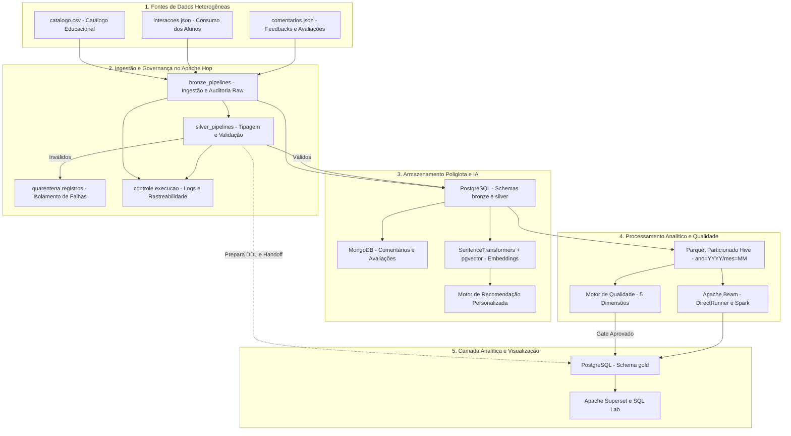

# Plataforma Integrada de Engenharia de Dados e Inteligência Artificial

Projeto desenvolvido para o **Desafio Prático 4 do Curso FIC_DEV — Programador de Sistemas com IA**, correspondente ao **2º Desafio do Módulo de Fundamentos de Dados para IA**.

O projeto consolida uma arquitetura corporativa moderna de ponta a ponta: ingestão heterogênea e orquestrada com Apache Hop (Bronze e Silver), persistência poliglota com PostgreSQL e MongoDB, geração de embeddings semânticos e motor de recomendação com IA, particionamento colunar Parquet em padrão Hive, processamento distribuído com Apache Beam, motor de governança de qualidade de dados com barreiras críticas e camada Gold analítica consumida via Apache Superset.

---

## Identificação Acadêmica

- **Curso:** FIC_DEV — Programador de Sistemas com IA
- **Módulo:** Fundamentos de Dados para IA
- **Contexto:** Desafio Prático 4 do Curso / 2º Desafio do Módulo de Dados para IA
- **Instituição:** SECITECI / Escola Técnica Estadual de Cuiabá
- **Turma:** Vespertino — 2026
- **Equipe:**
  - Diego Assunção Leite
  - Gabriel Moreira Branco
  - Gabriel André de Siqueira Nonato
- **Repositório:** [https://github.com/Gabriel-M-Branco/desafio-04-Fundamentos-de-Dados-para-IA](https://github.com/Gabriel-M-Branco/desafio-04-Fundamentos-de-Dados-para-IA)

---

## Arquitetura Unificada do Sistema

A solução adota o padrão **Medallion Architecture (Bronze / Silver / Gold)** combinado com conceitos de **Data Lakehouse** e **IA Integrada**:



> **Fundamentação Arquitetural (RF19):** Para o detalhamento completo de onde ocorrem Extração, Transformação e Carga, justificativa da classificação como **Arquitetura Híbrida (ETL + ELT)** sob as óticas de custo, governança, desempenho e reprocessamento, e o contraste com as limitações dos scripts isolados do Desafio 1, consulte o documento oficial [documentacao/arquitetura_etl_elt.md](documentacao/arquitetura_etl_elt.md).

---

## Guia Rápido de Execução (Quickstart)

Para quem já possui o ambiente preparado (Git, Docker e Python 3.10+) e deseja executar todo o ecossistema ponta a ponta rapidamente:

```bash
# 1. Clonar o repositório e entrar na pasta
git clone https://github.com/Gabriel-M-Branco/desafio-04-Fundamentos-de-Dados-para-IA.git
cd desafio-04-Fundamentos-de-Dados-para-IA

# 2. Criar ambiente virtual e instalar dependências
python -m venv .venv
# Ativar venv:
# No Windows PowerShell: .\.venv\Scripts\Activate.ps1
# No Linux/macOS:        source .venv/bin/activate
pip install --upgrade pip
pip install -r requirements.txt

# 3. Criar arquivo de configuração .env a partir do modelo
# No Windows PowerShell: Copy-Item .env.example .env
# No Linux/macOS:        cp .env.example .env

# 4. Iniciar toda a infraestrutura conteinerizada
docker compose up -d

# 5. Executar o fluxo ponta a ponta de dados e IA
python -m src.main                                      # Carga base, pgvector e recomendações IA

# Ingestão Bronze/Silver e DDL Gold no Apache Hop (escolha uma das duas opções):
# Opção A (Terminal / Headless via Docker - compatível com PowerShell e Bash):
docker exec hop-web /usr/local/tomcat/webapps/ROOT/hop-run.sh --environment desafio4-dev --project desafio4 --file /files/workflows/workflow_principal.hwf --runconfig local --level BASIC
# Opção B (Navegador via Hop Web): acesse http://localhost:8080 e execute workflow_principal.hwf

# Pipeline analítico, Particionamento Parquet Hive, Testes RF31, LGPD e Apache Beam:
python -m src.executar_etapas --etapa todas

# 6. Governança, Metadados e Sincronização Analítica
python scripts/demonstrar_dados_mestres.py              # MDM / Golden Record (RF30)
python scripts/configurar_openmetadata.py               # Catálogo, Glossário e Linhagem 5 pontas (RF27-RF29)
python dashboard/sync_database.py                       # Importação dos dashboards no Apache Superset (RF16-RF18)

# 7. Executar a suíte completa com 98 testes automatizados
python -m pytest tests/
```

> **Painéis Web e Portas de Acesso Local:**
> - **Apache Superset (BI, Storytelling e Alertas):** [http://localhost:8088](http://localhost:8088) (`admin` / `admin`)
> - **OpenMetadata (Catálogo, Glossário e Linhagem):** [http://localhost:8585](http://localhost:8585) (`admin@openmetadata.org` / `admin`)
> - **Apache Hop Web (Orquestrador e Pipelines ETL):** [http://localhost:8080](http://localhost:8080) (`admin` / `admin`)

---

## Guia Detalhado de Instalação e Execução Multiplataforma

O projeto foi configurado com **caminhos 100% relativos** e conteinerização completa, garantindo execução estável no **Windows**, **macOS** e nas **principais distribuições Linux** (Ubuntu/Debian, Fedora/RHEL, Arch).

### 1. Pré-requisitos
- **Git** instalado.
- **Docker** e **Docker Compose** (Docker Desktop no Windows/macOS ou Docker Engine + Compose plugin no Linux).
- **Python 3.10 ou superior** instalado localmente.

---

### 2. Clonar e Acessar o Repositório

```bash
git clone https://github.com/Gabriel-M-Branco/desafio-04-Fundamentos-de-Dados-para-IA.git
cd desafio-04-Fundamentos-de-Dados-para-IA
```

---

### 3. Configurar o Ambiente Virtual (Python venv)

Selecione o seu sistema operacional:

#### No Windows (PowerShell):
```powershell
python -m venv .venv
.\.venv\Scripts\Activate.ps1
```

#### No Windows (Prompt de Comando — CMD):
```cmd
python -m venv .venv
.\.venv\Scripts\activate.bat
```

#### No macOS e Linux (Ubuntu, Debian, Fedora, Arch):
```bash
python3 -m venv .venv
source .venv/bin/activate
```

---

### 4. Instalar as Dependências

Com o ambiente virtual ativo:
```bash
pip install --upgrade pip
pip install -r requirements.txt
```

---

### 5. Configurar o Arquivo de Variáveis de Ambiente (`.env`)

O arquivo `.env.example` já inclui os parâmetros padronizados para execução local no Docker:

#### No Windows (PowerShell):
```powershell
Copy-Item .env.example .env
```

#### No macOS / Linux:
```bash
cp .env.example .env
```

> **Dica:** Os valores padrão do `.env.example` funcionam perfeitamente para testes locais em contêiner.

---

### 6. Subir a Infraestrutura (Docker Compose)

Inicie todos os serviços do ecossistema:
```bash
docker compose up -d
```

Verifique se todos os contêineres estão saudáveis e operacionais:
```bash
docker compose ps
```

#### Serviços Ativos e Registro Oficial de Versões (RF15)

| Tecnologia / Serviço | Contêiner / Imagem | Versão Fixada | Porta | Finalidade no Desafio 2 |
| :--- | :--- | :---: | :---: | :--- |
| **Apache Hop** | `apache/hop-web` | **`2.11.0`** *(latest)* | `8080` | Interface visual de ETL, workflows e refino Silver. |
| **Apache Beam** | `apache-beam` (Python SDK) | **`2.54.0`** | Host/CLI | Agregação, transformações e cálculo de KPIs analíticos. |
| **Apache Spark** | `apache/beam_spark_job_server` | **`2.54.0`** *(Spark 3.4)* | `8098:8099` | Runtime distribuído de processamento Apache Spark para Beam. |
| **Apache Superset** | `apache/superset` | **`4.0.2`** | `8088` | Plataforma analítica de BI, consultas SQL Lab e dashboards. |
| **OpenMetadata Server** | `openmetadata/server` | **`1.4.6`** | `8585` | Catálogo de dados, linhagem ponta a ponta e governança (RF27-RF30). |
| **Elasticsearch** | `openmetadata-elasticsearch` | **`8.10.2`** | `9200` | Motor de busca e indexação de metadados para o OpenMetadata. |
| **PostgreSQL** | `postgres` (`pgvector:pg16`) | **`PostgreSQL 16`** | `5432` | Banco relacional, extensão pgvector e schemas Medalhão (`bronze`, `silver`, `gold`, `quarentena`, `controle`). |
| **MongoDB** | `mongodb` (`mongo:8`) | **`8.0`** | `27017` | Persistência NoSQL orientada a documentos para avaliações e comentários. |

---

### 7. Execução do Pipeline Ponta a Ponta

Para executar toda a plataforma de forma sequencial e integrada, siga as 4 etapas abaixo:

#### Etapa A: Carga Base, IA e Embeddings (Motor Legado e Pré-requisitos)
Gera o catálogo de conteúdos, carrega o MongoDB, calcula embeddings com `sentence-transformers` na extensão `pgvector` e gera as recomendações personalizadas:

```bash
python -m src.main
```

> Este comando garante a presença das referências em `public.usuarios` e `public.conteudos`, que são validadas na etapa de integridade referencial do Apache Hop.

#### Etapa B: Ingestão e Governança de Borda no Apache Hop (RF20 a RF23 e RF26)
O Apache Hop executa o workflow integrado mestre `workflow_principal.hwf`, que lê os arquivos de `dados/brutos/`, grava a camada bruta com metadados de auditoria em `bronze.*`, valida e padroniza em `silver.*`, isola inconsistências em `quarentena.registros`, provisiona o DDL analítico [sql/camada_gold.sql](sql/camada_gold.sql) e registra no schema `controle` a prontidão dos dados e o handoff para a esteira analítica distribuída.

Você pode rodá-lo por **qualquer uma das opções**:

- **Opção 1 — Pela Interface Web (Hop Web no Navegador — Play):**
  1. Acesse no navegador: [http://localhost:8080](http://localhost:8080).
  2. Na árvore de arquivos à esquerda (pasta `default`), dê dois cliques na pasta **`workflows`** e abra **`workflow_principal.hwf`** (ou use o ícone de pasta amarela no menu superior para abrir).
  3. Com o fluxograma aberto na tela, clique no ícone de **Play (Executar)** na barra superior do fluxo.
  4. Na janela de diálogo, selecione a run configuration **`local`** e clique em **Launch**.
  
- **Opção 2 — Pela Linha de Comando (Headless via Docker):**
  ```bash
  docker exec hop-web /usr/local/tomcat/webapps/ROOT/hop-run.sh --environment desafio4-dev --project desafio4 --file /files/workflows/workflow_principal.hwf --runconfig local --level BASIC
  ```

#### Etapa C: Formato Colunar Parquet, Qualidade de Dados, LGPD e Apache Beam (RF24, RF25, RF31, RF32/RF33)
Com a camada Silver validada e as estruturas analíticas preparadas, execute a esteira de processamento colunar Parquet, qualidade de dados e computação da camada Gold via Apache Beam:

```bash
python -m src.executar_etapas --etapa todas
```

O orquestrador modular executará de forma encadeada:
1. **RF20 a RF23 (Ingestão Integrada & Quarentena):** Ingesta os dados brutos e avalia simultaneamente a suíte de cenários de teste em `dados/brutos/cenarios_de_teste/`. Os registros inválidos (completude com campos nulos, notas 7.5 ou -1.0, conclusões de 150%, duplicatas de chave e integridade referencial com chaves órfãs) são identificados pelas regras de validação e segregados para a Quarentena (`quarentena.registros` no PostgreSQL e `dados/quarentena/quarentena_RUN_INTEGRADO_BRONZE_SILVER.json`), garantindo que apenas dados 100% limpos cheguem à Silver.
2. **RF24 (Parquet Hive):** Exporta os registros limpos da Silver para formato colunar particionado (`dados/parquet/interacoes/particionado/ano=2026/mes=MM/`).
3. **RF24 (Benchmark):** Executa o teste comparativo de performance de leitura colunar (Parquet vs CSV vs JSON com 5 repetições).
4. **RF31 (Qualidade de Dados / Quality Gate):**
   - **Camada Silver (Produção):** Avalia as 5 dimensões corporativas (Completude, Validade, Unicidade, Consistência e Integridade Referencial). Resultado: `APROVADO_INTEGRAL` e `bloquear_publicacao_gold = False` (liberando a publicação da camada Gold).
   - **Cenários de Teste (Governança e Falhas):** Submete os dados brutos defeituosos ao motor de qualidade oficial. Resultado: `REPROVADO_CRITICO` e `bloquear_publicacao_gold = True`, gerando o relatório diagnóstico `dados/processados/qualidade_cenarios_teste.json` e comprovando em tempo de execução que dados corrompidos ativam a barreira de segurança (*Quality Gate*).
5. **RF32 e RF33 (Proteção de Dados e LGPD):** Demonstra em tempo real as técnicas de privacidade aplicadas aos dados dos cenários: mascaramento dinâmico de nomes de autores, pseudonimização determinística via UUIDv5 e hashing criptográfico irreversível com salt via HMAC-SHA256.
6. **RF25 (Apache Beam e Runtimes):** Agrega os KPIs analíticos mensais e de desempenho via DirectRunner e avalia o cluster Spark, gravando em Parquet analítico (`dados/parquet/gold/kpis_mensais_categoria.parquet`).
7. **RF26 (Camada Gold):** Sincroniza e consolida as tabelas analíticas no PostgreSQL (`gold.kpis_mensais_categoria`, `gold.desempenho_conteudos` e visões executivas) e atualiza as amostras físicas em `dados/gold/`.

#### Etapa D: Dados Mestres (MDM) e Governança no OpenMetadata (RF27 a RF30)
Para consolidar a resolução de conflitos cadastrais e catalogar os metadados técnicos e termos de negócio:

1. **Reconciliação de Dados Mestres (RF30):**
   Executa o motor de correspondência (*Matching*) e regras de sobrevivência (*Survivorship*), extraindo dois registros reais conflitantes diretamente da tabela `silver.catalogo` do PostgreSQL:
   ```bash
   python scripts/demonstrar_dados_mestres.py
   ```
   *Evidência gerada:* `dados/processados/resultado_dados_mestres.json` e documentação técnica em [`documentacao/dados_mestres.md`](documentacao/dados_mestres.md).

2. **Configuração, Governança e Linhagem no OpenMetadata (RF27 a RF29):**
   Conecta na API REST oficial do OpenMetadata via *Metadata as Code*, autentica de forma segura via credenciais do `.env`, cataloga as 12 entidades nas 4 camadas (`fontes`, `bronze`, `silver`, `gold`), o serviço de dashboard do Apache Superset (`ficdev_superset`), estabelece o grafo com as 19 arestas de linhagem de 5 pontas (**Fontes $\rightarrow$ Bronze $\rightarrow$ Silver $\rightarrow$ Gold $\rightarrow$ Dashboard — RF29**), sincroniza o glossário de negócio (RF28) e exporta o dossiê formal de auditoria:
   ```bash
   python scripts/configurar_openmetadata.py
   ```
   *Otimização de Recursos:* O container de ingestão nativo baseado em Apache Airflow foi desativado por padrão, gerando uma economia de **~3.0 GB de RAM** sem qualquer perda funcional. Toda a governança é provisionada em segundos via API REST oficial.  
   *Evidência gerada:* `openmetadata/dossie_metadados_oficial.json` e documentação técnica em [`documentacao/governanca_openmetadata.md`](documentacao/governanca_openmetadata.md).  
   *Acesso Web:* [http://localhost:8585](http://localhost:8585) (Login: **`admin@openmetadata.org`** / Senha: valor de `OPENMETADATA_ADMIN_PASSWORD` no `.env`).

---

## Verificação e Conferência dos Resultados

### 1. No PostgreSQL
Para auditar a volumetria populada em todas as camadas da arquitetura Medalhão:

```bash
docker exec -it postgres psql -U postgres -d ficdev_recomendacao -c "
SELECT 'bronze.catalogo_raw' as tabela, count(*) FROM bronze.catalogo_raw
UNION ALL SELECT 'bronze.interacoes_raw', count(*) FROM bronze.interacoes_raw
UNION ALL SELECT 'bronze.comentarios_raw', count(*) FROM bronze.comentarios_raw
UNION ALL SELECT 'silver.catalogo', count(*) FROM silver.catalogo
UNION ALL SELECT 'silver.interacoes', count(*) FROM silver.interacoes
UNION ALL SELECT 'silver.comentarios', count(*) FROM silver.comentarios
UNION ALL SELECT 'quarentena.registros', count(*) FROM quarentena.registros
UNION ALL SELECT 'controle.execucao_workflow', count(*) FROM controle.execucao_workflow
UNION ALL SELECT 'gold.kpis_mensais_categoria', count(*) FROM gold.kpis_mensais_categoria
UNION ALL SELECT 'gold.desempenho_conteudos', count(*) FROM gold.desempenho_conteudos;
"
```

### 2. No MongoDB
Consulte a coleção semiestruturada e teste agregações:
```bash
python -c "from src.config import carregar_config; from src.database.mongo import agregar_por_categoria; print(agregar_por_categoria(carregar_config()))"
```

### 3. Testes Automatizados da Aplicação
Execute a suíte com **98 testes automatizados**:
```bash
python -m pytest tests/
```

### 4. No Apache Superset (Consumo Analítico, Storytelling e Alertas — RF16 a RF18 e RF26)

O Apache Superset é a interface oficial de consumo dos tomadores de decisão pedagógicos e analíticos da plataforma FIC_DEV.

1. **Acesso à Interface Web:**
   * **URL no Navegador:** [http://localhost:8088](http://localhost:8088)
   * **Credenciais Padrão:** Usuário `admin` | Senha `admin` (configuradas no `.env`).

2. **Como Visualizar os Dashboards (Suporte Dual):**
   * No menu superior, clique em **Dashboards**.
   * Estão disponíveis e homologados ambos os painéis analíticos:
     - **`Dashboard - Desafio 4` (Principal / RF16 a RF18):** Painel executivo oficial do Desafio 4 focado na narrativa de Storytelling pedagógico, retenção por tipo de conteúdo, evasão em cursos, interatividade por filtros cruzados, datasets virtuais do SQL Lab e alertas de negócio. Consome dados agregados exclusivamente da camada analítica `gold` (`kpis_mensais_categoria`, `desempenho_conteudos`, `vw_ranking_conteudos_engajamento`), blindando o banco relacional contra consultas analíticas nas camadas Bronze e Silver.
     - **`Dashboard - Desafio 3` (Legado):** Painel analítico construído na etapa anterior, preservado para rastreabilidade histórica, consumindo os datasets do schema `public` (`usuarios`, `conteudos`, `interacoes`, `recomendacoes`).
   * **Importação Automatizada:** O script [`dashboard/sync_database.py`](dashboard/sync_database.py) importa automaticamente ambos os pacotes de exportação (`dashboard_desafio_3.zip` e `dashboard_desafio_4.zip`) para a instância do Superset, mantendo os dois disponíveis simultaneamente.

3. **Narrativa do Storytelling Executivo (RF16):**
   O dashboard foi estruturado em uma sequência lógica de 3 gráficos encadeados:
   * **Passo 1 (Contexto — Atratividade):** Gráfico de Pizza (*Distribuição de acesso por tipo de conteúdo*) demonstrando quais formatos atraem mais visualizações iniciais dos alunos (Artigos e Podcasts).
   * **Passo 2 (Evidência — Retenção do Funil):** Gráfico de Barras Agrupadas (*STORYTELLING - Retenção por Tipo*) confrontando inícios versus conclusões e revelando o gargalo de evasão em formatos extensos como Cursos.
   * **Passo 3 (Ação Recomendada — Matriz de Desempenho):** Bubble Chart (*STORYTELLING - Desempenho de cada Tipo*) cruzando volume de consumo, notas médias de satisfação e taxa de conclusão por nível didático.

4. **Interatividade por Filtro Cruzado (*Cross-Filtering* — RF18):**
   * O recurso está ativo globalmente: **clique em qualquer elemento visual** (por exemplo, na fatia *"Curso"* ou *"Podcast"* do gráfico de pizza do Passo 1).
   * Imediatamente, todos os demais gráficos do Storytelling e painéis do SQL Lab recalculam suas métricas para o recorte selecionado.

5. **Barra Lateral de Filtros Globais (*Filter Bar* — RF18):**
   * No painel retrátil à esquerda da tela:
     * **Filtro 1 — Dimensão de Negócio:** Permite seleção múltipla por área temática (`categoria`), como *Inteligência Artificial*, *Segurança & Governança*, *Business Intelligence*, etc.
     * **Filtro 2 — Período:** Seletor nativo de intervalo temporal de datas.

6. **Consultas Virtuais e Datasets no SQL Lab (RF17):**
   * No menu superior, acesse **SQL** $\rightarrow$ **SQL Lab**.
   * Selecione o Banco de Dados `ficdev_postgresql` e o Schema **`gold`**.
   * O repositório disponibiliza as consultas modeladas em [`sql/sql_lab.sql`](sql/sql_lab.sql), contendo `JOIN` entre tabelas Gold, funções temporais (`MAKE_DATE`), agregações e classificações condicionais (`CASE WHEN`).
   * As consultas alimentam os datasets virtuais do dashboard: *SQLab - Análise de Eficiência e Evasão do Funil por Categoria* e *SQLab - Indicadores por Mês*.

7. **Monitoramento Ativo por Alerta de Negócio (RF18):**
   * No menu superior direito, clique em **Settings (ícone de engrenagem)** $\rightarrow$ **Alerts & Reports**.
   * Observe o alerta configurado: **`Alerta Crítico: Baixo Tempo Total de Consumo por Categoria`**.
   * **Regra de Disparo:** Consulta SQL Observer que monitora o mês mais recente na camada Gold e dispara notificação caso o tempo médio de estudo mensal fique abaixo de `500 minutos`.

---

### 5. No OpenMetadata (Catálogo, Glossário, Linhagem e LGPD — RF27 a RF30)

O OpenMetadata é a plataforma central de governança, catálogo unificado e rastreabilidade da arquitetura de dados.

> **Como a Governança é Populada (Automação via API REST):**  
> Para garantir 100% de reprodutibilidade e evitar consumo excessivo de memória com agentes de orquestração do Apache Airflow (`PIPELINE_SERVICE_CLIENT_ENABLED: false`), toda a catalogação (serviço do PostgreSQL, database, schemas `silver` e `gold`, tabelas, tags LGPD `PII.Sensitive`, linhagem gráfica e os 4 termos de glossário) é provisionada de forma automatizada via API REST pelo comando:
> ```bash
> python scripts/configurar_openmetadata.py
> ```
> *Nota Técnica:* Não é necessário tentar criar o conector manualmente pela interface web clicando em *"Test Connection"*, pois esse botão tenta despachar uma DAG para um agente do Airflow que foi desabilitado intencionalmente no Docker Compose para manter o ambiente leve. O script Python acima já realiza a integração completa e instantânea via API.

1. **Acesso à Interface Web:**
   * **URL no Navegador:** [http://localhost:8585](http://localhost:8585)
   * **Credenciais Oficiais de Administrador:**
     * **E-mail de Login:** `admin@openmetadata.org`  
       *(Importante: o OpenMetadata adota o padrão corporativo de autenticação básica exigindo obrigatoriamente o endereço de e-mail no campo de usuário, e não apenas o login textual `admin`)*.
     * **Senha:** `admin`

2. **Catálogo de Dados e Metadados Técnicos (RF27 e RF28):**
   * No menu lateral esquerdo, clique em **Explore** $\rightarrow$ **Tables**.
   * Visualize as entidades catalogadas da plataforma nas camadas **`silver`** e **`gold`**:
     * `ficdev_postgres.ficdev_recomendacao.gold.kpis_mensais_categoria`
     * `ficdev_postgres.ficdev_recomendacao.gold.desempenho_conteudos`
     * `ficdev_postgres.ficdev_recomendacao.silver.catalogo`
   * Cada tabela exibe esquema colunar, tipos de dados, descrições e proprietário atribuído (*Owner*).

3. **Glossário de Negócio e Termos Oficiais (RF28):**
   * No menu lateral esquerdo, clique em **Govern** $\rightarrow$ **Glossary**.
   * Abra o `Glossario_Educacional_FICDEV` e confira os **4 termos de negócio obrigatórios** cadastrados (especificados em [`openmetadata/dossie_metadados_oficial.json`](openmetadata/dossie_metadados_oficial.json)):
     1. **`Usuário Ativo`:** Aluno com interação no período de apuração; vinculado à coluna `usuarios_ativos` da Gold.
     2. **`Taxa de Conclusão`:** Razão percentual entre conclusões e inícios; vinculada a `taxa_conclusao_pct`.
     3. **`Tempo Médio de Consumo`:** Duração média em minutos de estudo; vinculada a `tempo_medio_min`.
     4. **`Conversão de Recomendação`:** Taxa de aceite dos materiais sugeridos pela IA; vinculada a `ranking_categoria`.

4. **Classificações de Privacidade e Sensibilidade LGPD (RF28 e RF32):**
   * Abra a tabela `desempenho_conteudos` (em *Explore -> Tables*).
   * Observe na coluna **`autor`** a tag azul aplicada: **`PII.Sensitive`**, protegendo o dado pessoal de identificação conforme o inventário formal da LGPD.

5. **Linhagem Gráfica de Dados Ponta a Ponta (*Lineage* — RF29):**
   * Ao abrir a tabela `gold.kpis_mensais_categoria` ou `gold.desempenho_conteudos`, clique na aba superior **Lineage**.
   * Visualize o grafo de proveniência dos dados conectado graficamente a partir de `silver.catalogo`, demonstrando a rastreabilidade do pipeline.

6. **Controles Anti-Data Swamp (RF27):**
   * O ambiente impede a degradação em "pântano de dados" ao restringir a catalogação a esquemas homologados, exigindo descrições mandatórias, donos formais e aplicação de termos de glossário antes da liberação para consumo.

7. **Evidências Fotográficas do Catálogo e Governança (RF34):**
   Os screenshots homologados da interface web do OpenMetadata estão organizados em [`openmetadata/evidencias/`](openmetadata/evidencias/):
   - `01_catalogo_detalhes_tabela_gold.png`: Detalhes da tabela Gold, colunas, tipos e proprietário no Catálogo de Dados.
   - `02_glossario_quatro_termos_oficiais.png`: Visão geral do Glossário Corporativo com os 4 termos oficiais cadastrados.
   - `03_termo_glossario_usuario_ativo.png`: Definição conceitual, fórmula matemática e dono do termo *Usuário Ativo*.
   - `04_termo_glossario_taxa_conclusao.png`: Especificação formal e cálculo percentual da *Taxa de Conclusão*.
   - `05_termo_glossario_conversao_recomendacao.png`: Regra de negócio e aplicação do termo *Conversão de Recomendação*.
   - `06_termo_glossario_tempo_medio_consumo.png`: Fórmula e unidade de medida do *Tempo Médio de Consumo*.
   - `07_glossario_ativos_vinculados_gold.png`: Relação de colunas e entidades da camada Gold associadas aos termos.
   - `08_linhagem_grafica_cinco_pontas.png`: Grafo interativo de linhagem conectando Fontes $\rightarrow$ Bronze $\rightarrow$ Silver $\rightarrow$ Gold $\rightarrow$ Dashboard Superset.

---

## Especificação Técnica dos Módulos

### 1. Ingestão e Governança com Apache Hop (RF20 a RF23)
- **Schema `bronze`:** Ingestão das fontes brutas com campos de metadados: `origem`, `data_hora_ingestao` e `id_execucao`.
- **Schema `silver`:** Padronização e tipagem de campos, desduplicação por chaves de negócio e validação referencial.
- **Schema `quarentena`:** Isolamento de linhas rejeitadas com diagnóstico e payload JSON íntegro na tabela `quarentena.registros`.
- **Schema `controle`:** Rastreabilidade por lote e etapas nas tabelas `execucao_workflow` e `execucao_etapa`.
- **Portabilidade:** Todos os fluxos utilizam `${Internal.Workflow.Filename.Folder}` e `${Internal.Pipeline.Filename.Folder}`, sem dependências de caminhos absolutos locais.

### 2. Armazenamento Poliglota e Inteligência Artificial (RF06 a RF11)
- **PostgreSQL com pgvector:** Armazenamento vetorial com índices para busca por similaridade de cosseno.
- **MongoDB:** Armazenamento de avaliações e comentários desnormalizados para agregação flexível.
- **SentenceTransformers:** Embeddings multilíngues gerados com `paraphrase-multilingual-MiniLM-L12-v2` (384 dimensões).
- **Motor de Recomendação:** Fórmula ponderada de afinidade (`Ivis`), curtidas (`Icur`) e filtro de conclusão (`Iconc`).

### 3. Formato Colunar e Particionamento Parquet Hive (RF24)
- **Particionamento:** Estrutura Hive por período (`ano=YYYY/mes=MM`) para *partition pruning*.
- **Tipagem Estrita:** Esquema imutável via PyArrow preservando campos de auditoria corporativa.
- **Benchmark:** Redução de ~89% no volume em disco comparado ao JSON e ganhos expressivos em tempo de consulta com projeção colunar.
- **Relatório Técnico:** [`documentacao/benchmark_parquet.md`](documentacao/benchmark_parquet.md).

### 4. Processamento Distribuído com Apache Beam e Spark (RF25)
- **Pipeline:** Transformações em janela com `beam.CombinePerKey` determinístico para cálculo de métricas educacionais.
- **Runtimes:** DirectRunner validado e diagnóstico completo de execução distribuída via Spark Job Server.
- **Relatório Técnico:** [`documentacao/execucao_beam_spark.md`](documentacao/execucao_beam_spark.md).

### 5. Motor de Qualidade de Dados (RF31)
- **5 Dimensões Avaliadas:**
  1. *Completude (Q01):* Taxa de preenchimento de campos obrigatórios.
  2. *Validade (Q02):* Conformidade com regras de intervalo (notas 1 a 5, percentuais 0 a 100%).
  3. *Unicidade (Q03):* Ausência de chaves primárias duplicadas.
  4. *Consistência (Q04):* Coerência entre conclusão de conteúdo e percentual de término.
  5. *Integridade Referencial (Q05):* Ausência de registros órfãos sem correspondência no catálogo.
- **Barreira Bloqueadora (Quality Gate):** Falhas críticas impedem a escrita e publicação na Gold (`FalhaQualidadeDadosCriticaError`).
- **Relatório Técnico:** [`documentacao/qualidade_dados.md`](documentacao/qualidade_dados.md).

### 6. Camada Gold para Consumo Analítico (RF26)
- **Modelagem Analítica:** Tabelas `gold.kpis_mensais_categoria` e `gold.desempenho_conteudos` e visões analíticas de suporte.
- **Desacoplamento:** O consumo analítico consulta estritamente a Gold, blindando as camadas Bronze e Silver de sobrecargas.
- **Relatório Técnico:** [`documentacao/camada_gold.md`](documentacao/camada_gold.md).

---

## Estrutura do Repositório

```text
desafio-04-Fundamentos-de-Dados-para-IA/
├── config/                  # Configuração funcional da aplicação (YAML)
├── dados/                   # Camadas de dados físicas (brutos, parquet e processados)
│   ├── brutos/              # Fontes originais (catalogo.csv, interacoes.json, comentarios.json)
│   ├── parquet/             # Dados colunares particionados (Hive) e saídas analíticas
│   └── processados/         # Resultados intermediários, histórico de qualidade e benchmarks
├── dashboard/               # Pacotes de exportação e sincronização com Apache Superset
├── documentacao/            # Relatórios técnicos aprofundados e especificações formais
├── hop/                     # Projeto Apache Hop (workflows .hwf, pipelines .hpl e metadados)
│   ├── environments/        # Configuração de variáveis por ambiente
│   ├── metadata/            # Conexões de banco de dados e run configurations
│   ├── pipelines/           # Pipelines de ingestão Bronze e Silver
│   └── workflows/           # Workflows orquestradores de execução
├── lgpd/                    # Governança e proteção de dados pessoais (RF32 e RF33)
│   ├── inventario_de_dados.md
│   └── tecnicas_de_protecao.md
├── mongodb/                 # Scripts e consultas de agregação NoSQL
├── openmetadata/            # Governança de metadados, dossiê oficial e evidências (RF27 a RF29, RF34)
│   ├── dossie_metadados_oficial.json
│   └── evidencias/
├── scripts/                 # Automações de setup e testes (OpenMetadata, MDM, etc.)
├── sql/                     # DDLs relacionais, DDLs Medalhão e consultas SQL
├── src/                     # Código-fonte Python modular
│   ├── beam/                # Pipelines analíticos e comparador de runtimes Apache Beam
│   ├── database/            # Conectores PostgreSQL e MongoDB
│   ├── gold/                # Publicador e modelador da Camada Gold
│   ├── ingestao/            # Validação e processamento de dados
│   ├── parquet/             # Exportador particionado e benchmark colunar
│   ├── qualidade/           # Motor de avaliação das 5 dimensões de qualidade
│   └── recomendacao/        # Embeddings com SentenceTransformers e busca semântica
├── tests/                   # Suíte de 98 testes automatizados (Pytest)
├── docker-compose.yml       # Orquestração de todos os serviços conteinerizados
├── requirements.txt         # Dependências Python versionadas
├── .env.example             # Modelo de configuração de variáveis de ambiente
└── README.md                # Documentação técnica e guia unificado de execução
```

---

## Sumário da Documentação Complementar

Para aprofundamento técnico em cada módulo específico, consulte:

- [`documentacao/arquitetura_etl_elt.md`](documentacao/arquitetura_etl_elt.md): Fundamentação formal da Arquitetura Híbrida (ETL na borda com Hop e ELT no Core com Beam).
- [`documentacao/especificacao_tecnica.md`](documentacao/especificacao_tecnica.md): Especificação de modelagem relacional, pgvector e motor de recomendação.
- [`documentacao/benchmark_parquet.md`](documentacao/benchmark_parquet.md): Metodologia e resultados do benchmark empírico Parquet vs CSV vs JSON.
- [`documentacao/execucao_beam_spark.md`](documentacao/execucao_beam_spark.md): Comparação de runtimes Apache Beam (DirectRunner vs Spark) e compatibilidade de ambiente.
- [`documentacao/qualidade_dados.md`](documentacao/qualidade_dados.md): Regras formais, fórmulas, severidades e histórico das 5 dimensões de qualidade.
- [`documentacao/camada_gold.md`](documentacao/camada_gold.md): Modelagem dimensional, granularidade, medidas e visões analíticas da Gold.
- [`documentacao/kpis.md`](documentacao/kpis.md): Definição de métricas de negócio e indicadores de decisão pedagógicos.
- [`documentacao/governanca_openmetadata.md`](documentacao/governanca_openmetadata.md): Governança no OpenMetadata, catálogo Silver/Gold, glossário com 4 termos, linhagem de 5 pontas e otimização de memória (*Metadata as Code*).
- [`documentacao/uso_da_ia.md`](documentacao/uso_da_ia.md): Registro de governança sobre o uso de ferramentas de Inteligência Artificial.
- [`lgpd/inventario_de_dados.md`](lgpd/inventario_de_dados.md): Inventário formal de dados pessoais, bases legais (Art. 7º) e ciclo de retenção (RF32).
- [`lgpd/tecnicas_de_protecao.md`](lgpd/tecnicas_de_protecao.md): Especificação e prova de mascaramento, pseudonimização e hashing SHA-256 com salt dinâmico (RF33).
- [`hop/README.md`](hop/README.md): Documentação detalhada dos workflows e pipelines do Apache Hop.

---

## Autores

- **Diego Assunção Leite**
- **Gabriel Moreira Branco**
- **Gabriel André de Siqueira Nonato**

**Curso:** FIC_DEV — Programador de Sistemas com IA  
**Instituição:** SECITECI / Escola Técnica Estadual de Cuiabá  
**Ano:** 2026
