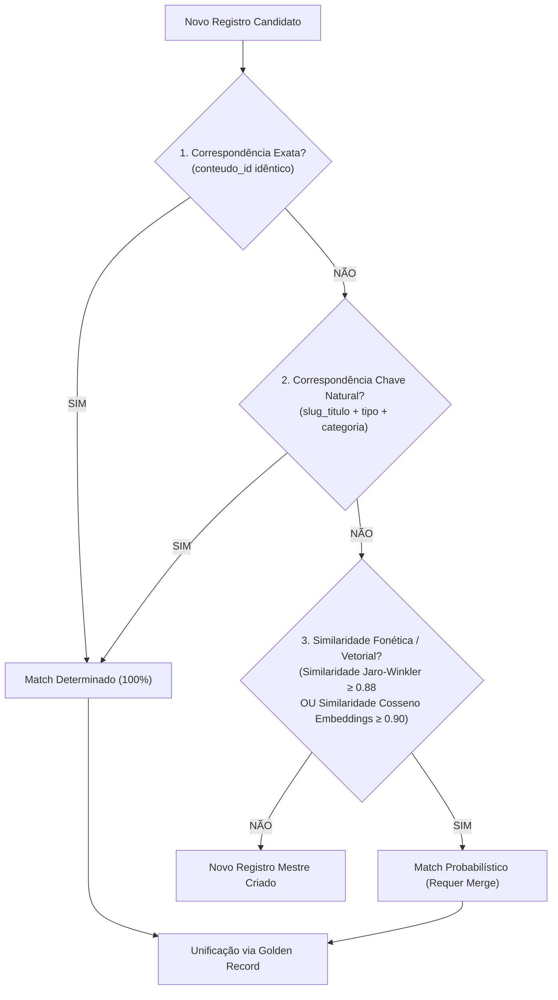

# Governança de Dados Mestres — Master Data Management (RF30)

**Projeto:** Plataforma Integrada de Engenharia de Dados e Inteligência Artificial  
**Módulo:** Governança e Qualidade de Dados (RF30)  
**Entidade Mestre Selecionada:** `Conteúdo Educacional` (com suporte a `Usuário`)  

---

## 1. Contexto e Justificativa

Em plataformas de aprendizagem que ingerem dados de múltiplos canais (catálogos administrativos, portais de parceiros, logs de telemetria e feedbacks de alunos), um mesmo material didático pode ser cadastrado ou referenciado com variações tipográficas, sinônimos ou divergências de metadados.

A ausência de uma disciplina de **Master Data Management (MDM)** acarreta:
1. Fragmentação de métricas (duplicação de cursos no Superset e cálculo disperso de evasão).
2. Recomendações concorrentes geradas pelo modelo de IA para a mesma aula.
3. Prejuízo à rastreabilidade analítica na Camada Gold.

O objetivo deste módulo é estabelecer a **Identidade Mestre Única (Golden Record)** para os conteúdos educacionais da plataforma FIC_DEV.

---

## 2. Definição da Entidade Mestre e Atributos Essenciais

### 2.1. Entidade Mestre: `Conteúdo Educacional`
- **Chave Natural / Negócio Primária:** `conteudo_id` (numérico legível do sistema de origem).
- **Chave de Negócio Semântica Composta:** `(slug_titulo, tipo_normalizado, categoria_normalizada)`.
- **Fonte de Referência (System of Record - SoR):** Catálogo Curado de Conteúdos (`catalogo.csv` / `silver.catalogo`).

### 2.2. Atributos Essenciais e Níveis de Criticidade

| Atributo | Tipo | Criticidade MDM | Política de Preenchimento | Regra de Padronização |
| :--- | :---: | :---: | :--- | :--- |
| **`master_id`** | String (UUIDv5) | **Mandatório** | Gerado deterministicamente | `MDM_CONTEUDO_<HASH>` |
| **`titulo`** | String | **Mandatório** | Obrigatório ($\ge 3$ caracteres) | Trim, espaços múltiplos suprimidos, Title Case |
| **`tipo`** | String | **Mandatório** | Domínio fechado | Curso, Vídeo, Artigo, Podcast |
| **`categoria`** | String | **Mandatório** | Domínio padronizado | 10 categorias oficiais FIC_DEV |
| **`nivel`** | String | **Importante** | Domínio fechado | Básico, Intermediário, Avançado |
| **`carga_horaria_min`** | Inteiro | **Importante** | Numérico positivo | Duração estimada em minutos ($\ge 1$) |
| **`autor`** | String | **Descritivo** | Sanitizado (LGPD) | Mascaramento para consumo externo |
| **`descricao`** | Texto | **Descritivo** | Base para Embeddings | Texto limpo sem HTML |

---

## 3. Regras de Correspondência (Matching Rules)

A identificação de duplicidades cadastrais ou registros correspondentes ocorre por um funil determinístico e probabilístico de 3 camadas:



---

## 4. Política de Sobrevivência de Atributos (Survivorship Rules)

Quando dois ou mais registros representam a mesma entidade mestre, o sistema constrói o **Registro Dourado (*Golden Record*)** aplicando as seguintes regras de sobrevivência ordenadas por prioridade:

1. **Confiabilidade da Fonte de Origem (*Source System Authority*):**
   - Nível 1: Catálogo Curado Acadêmico (peso 100).
   - Nível 2: Logs de Navegação e Interações (peso 70).
   - Nível 3: Comentários e Avaliações de Alunos (peso 40).
2. **Critério de Maior Completude (*Completeness Wins*):**
   - Atributos não-nulos e detalhados têm precedência sobre campos nulos ou genéricos.
3. **Critério de Atualidade Temporal (*Most Recent Record Wins*):**
   - Em caso de empate entre fontes confiáveis, o valor com carimbo de atualização (`data_publicacao` ou `data_hora`) mais recente é selecionado.

---

## 5. Tabela de Correspondência Cruzada (Cross-Reference / XREF)

Para garantir rastreabilidade reversa, o sistema mantém no PostgreSQL a tabela de correspondência:

```sql
CREATE TABLE IF NOT EXISTS mdm.xref_conteudo (
    master_id VARCHAR(64) NOT NULL,
    sistema_origem VARCHAR(50) NOT NULL,
    id_origem VARCHAR(50) NOT NULL,
    score_confianca NUMERIC(4,3) NOT NULL,
    data_vinculacao TIMESTAMP DEFAULT CURRENT_TIMESTAMP,
    regra_aplicada VARCHAR(100) NOT NULL,
    PRIMARY KEY (sistema_origem, id_origem)
);
```

---

## 6. Demonstração Prática: Tratamento de Dois Registros Conflitantes

### 6.1. Cenário Real Extraído Diretamente do Banco de Dados (PostgreSQL `silver.catalogo`)
Dois registros reais do catálogo com divergências de metadados para o mesmo curso sobre LGPD:

- **Registro A (PostgreSQL `silver.catalogo` - ID 588):**
  - `conteudo_id`: `588`
  - `titulo`: `"Análise Comparativa e Padrões Recomendados em Adequação à LGPD e Proteção de Dados Pessoais"`
  - `tipo`: `"Artigo"`
  - `categoria`: `"Segurança & Governança"`
  - `nivel`: `"Básico"` (edição inicial de 2024)
  - `carga_horaria_min`: `6`
  - `autor`: `"Dr. Fernando Zanin Pacheco"`
  - `data_publicacao`: `2024-01-23`

- **Registro B (PostgreSQL `silver.catalogo` - ID 919):**
  - `conteudo_id`: `919`
  - `titulo`: `"Análise Comparativa e Padrões Recomendados em Adequação à LGPD e Proteção de Dados Pessoais"`
  - `tipo`: `"Artigo"`
  - `categoria`: `"Segurança & Governança"`
  - `nivel`: `"Avançado"` (edição revisada e aprofundada)
  - `carga_horaria_min`: `22` (aula expandida)
  - `autor`: `"Eng. Rodrigo Alves Mendonça"`
  - `data_publicacao`: `2026-06-10`

### 6.2. Resolução pelo Motor de MDM
1. **Correspondência (Matching):** A similaridade entre os títulos é de **100.0%**, identificando que tratam da mesma temática central no acervo.
2. **Aplicação das Regras de Sobrevivência (Survivorship):**
   - `titulo`: Mantido o título homologado na íntegra.
   - `categoria`: `"Segurança & Governança"`.
   - `nivel`: Prevalece a especificação `"Avançado"` da versão expandida.
   - `carga_horaria_min`: Prevalece `22 min` (edição completa e atualizada).
   - `autor`: Unificação de autoria com histórico (`"Dr. Fernando Zanin Pacheco (Original) / Eng. Rodrigo Alves Mendonça (Revisão)"`).
3. **Identificador Mestre Unificado:**
   - `master_id`: `MDM_CONTEUDO_bc8872383fef5e14`
4. **Tabela de Correspondência XREF:**
   - `(POSTGRES_SILVER_CATALOGO_ID588, '588') -> MDM_CONTEUDO_bc8872383fef5e14 (Score: 1.0)`
   - `(POSTGRES_SILVER_CATALOGO_ID919, '919') -> MDM_CONTEUDO_bc8872383fef5e14 (Score: 1.0)`
5. **Resultado no Consumo (Gold / Superset):**
   - O dashboard e as métricas de engajamento agrupam o consumo de ambos os materiais sob a mesma chave mestre, evitando duplicidade analítica e cálculos incorretos de taxa de conclusão.

---

## 7. Instruções de Reprodução

Para executar a demonstração automatizada de reconciliação de dados mestres:
```bash
python scripts/demonstrar_dados_mestres.py
```
