# Governança de Metadados e Catálogo — OpenMetadata (RF27 a RF30, RF32)

**Projeto:** Plataforma Integrada de Engenharia de Dados e Inteligência Artificial  
**Módulo:** Governança, Rastreabilidade e Catálogo de Dados (RF27, RF28, RF29, RF30 e RF32)  
**Plataforma Adotada:** OpenMetadata v1.4.6  
**Abordagem Arquitetural:** *Metadata as Code* via API REST Oficial  

---

## 1. Visão Geral e Arquitetura de Governança

O **OpenMetadata** atua como o repositório central de governança, metadados técnicos e semânticos da plataforma FIC_DEV. Ele resolve os problemas de:
1. **Pântano de Dados (*Data Swamp* — RF27):** Impede o consumo de tabelas desordenadas e fontes não auditadas. Todos os esquemas das camadas Medalhão (`fontes`, `bronze`, `silver` e `gold`) são catalogados com donos (*owners*), contratos DDL e descrições técnicas obrigatórias.
2. **Ambiguidade Semântica (RF28):** Institui o Glossário de Negócio corporativo com 4 termos padronizados, vinculados diretamente às colunas das tabelas da camada Gold.
3. **Linhagem Completa Ponta a Ponta (*Data Lineage* — RF29):** Garante a auditabilidade de 5 pontas, mapeando visualmente todo o ciclo de vida da informação:
   $$\text{Fontes de Origem} \longrightarrow \text{Bronze (Raw)} \longrightarrow \text{Silver (Curated)} \longrightarrow \text{Gold (KPIs/Views)} \longrightarrow \text{Dashboard (Apache Superset)}$$
4. **Proteção à Privacidade e LGPD (RF32):** Classifica colunas com atributos identificáveis com a taxonomia corporativa `PII.Sensitive`.

---

## 2. Linhagem de Dados Ponta a Ponta com KPIs e SQL Lab Dataset (RF29)

Em conformidade estrita com o **RF29**, a plataforma mapeia no OpenMetadata a linhagem completa desde os dados de origem até a camada analítica de consumo no Apache Superset, **incluindo explicitamente os KPIs de negócio e o conjunto de dados virtual modelado no SQL Lab**:

```mermaid
graph LR
    subgraph S1["1. Fontes de Origem (Raw Files & NoSQL)"]
        F1["fontes.catalogo_csv<br/>(Arquivo CSV de Catálogo)"]
        F2["fontes.interacoes_json<br/>(Logs JSON de Telemetria)"]
        F3["fontes.comentarios_mongodb<br/>(Coleção NoSQL MongoDB)"]
    end

    subgraph S2["2. Camada Bronze (Ingestão & Auditoria Hop - RF20)"]
        B1["bronze.catalogo_raw<br/>(_origem, _ingestao_em, _run_id)"]
        B2["bronze.interacoes_raw<br/>(_origem, _ingestao_em, _run_id)"]
        B3["bronze.comentarios_raw<br/>(_origem, _ingestao_em, _run_id)"]
    end

    subgraph S3["3. Camada Silver (Curadoria, Tipagem & MDM - RF20/RF30)"]
        SIL1["silver.catalogo<br/>(Catálogo Homologado / Golden Record)"]
        SIL2["silver.interacoes<br/>(Eventos Desduplicados e Tipados)"]
        SIL3["silver.comentarios<br/>(Avaliações Sanitizadas)"]
    end

    subgraph S4["4. Camada Gold (KPIs & Modelos Analíticos Beam - RF26)"]
        G1["gold.kpis_mensais_categoria<br/>(KPIs Mensais: Taxa Conclusão, Usuários Ativos)"]
        G2["gold.desempenho_conteudos<br/>(Métricas por Conteúdo Beam/Parquet)"]
        G3["gold.vw_ranking_conteudos_engajamento<br/>(View Analítica de Ranking)"]
    end

    subgraph S5["5. Conjunto de Dados Virtual SQL Lab (RF17/RF29)"]
        SQLV["gold.dataset_virtual_sqllab<br/>(Dataset Virtual Storytelling Retenção)"]
    end

    subgraph S6["6. Consumo Analítico (Apache Superset - RF16 a RF18)"]
        DASH["ficdev_superset.desafio_4_dashboard<br/>(Dashboard Executivo FIC_DEV)"]
    end

    %% Etapa 1 -> 2
    F1 -->|Ingestão Hop| B1
    F2 -->|Ingestão Hop| B2
    F3 -->|Ingestão Hop| B3

    %% Etapa 2 -> 3
    B1 -->|Padronização Hop| SIL1
    B2 -->|Validação Hop| SIL2
    B3 -->|Sanitização Hop| SIL3

    %% Etapa 3 -> 4
    SIL1 -->|Apache Beam| G1
    SIL2 -->|Apache Beam| G1
    SIL1 -->|Consolidação Gold| G2
    SIL2 -->|Consolidação Gold| G2
    SIL3 -->|Consolidação Gold| G2
    SIL1 -->|View Analítica| G3
    SIL2 -->|View Analítica| G3

    %% Etapa 4 -> 5 (SQL Lab Virtual Dataset)
    G1 -->|JOIN SQL Lab| SQLV
    G2 -->|JOIN SQL Lab| SQLV

    %% Etapa 5 -> 6 (Dashboard Superset)
    G1 -->|Consumo Analítico| DASH
    G2 -->|Consumo Analítico| DASH
    G3 -->|Consumo Analítico| DASH
    SQLV -->|Storytelling Executivo| DASH
```



### Onde e Como se Define um KPI no OpenMetadata (RF28 / RF29)

O conceito de **KPI (Key Performance Indicator)** no OpenMetadata atua em três níveis complementares:

| Nível no OpenMetadata | Onde Localizar na UI | Como é Definido | Finalidade no Projeto |
| :--- | :--- | :--- | :--- |
| **1. Ativo de Dados Analítico (Linhagem RF29)** | **Explore $\rightarrow$ Tables $\rightarrow$ `kpis_mensais_categoria`** | Tabela dimensional que materializa as agregações de negócio calculadas pelo Apache Beam (`taxa_conclusao_pct`, `tempo_medio_min`, `usuarios_ativos`). | Permite rastrear visualmente de onde veio o KPI (upstream) e quais relatórios do Superset ele alimenta (downstream). |
| **2. Termo Formal de Negócio (Glossário RF28)** | **Govern $\rightarrow$ Glossary $\rightarrow$ `Glossario_Educacional_FICDEV`** | Cada KPI possui um termo formal com fórmula matemática (`ROUND(...)`), responsável (Data Owner) e vínculo à coluna física. | Elimina ambiguidade de cálculo e padroniza a semântica corporativa das métricas. |
| **3. Metas de Governança da Plataforma (Data Insights)** | **Govern $\rightarrow$ KPIs** (`/kpi`) | Ferramenta nativa do OpenMetadata para definir metas de qualidade e cobertura de metadados da governança (ex.: 80% das tabelas com descrição). | Monitorar a maturidade da governança e integridade do catálogo contra o *Data Swamp*. |

---

### Detalhamento das 19 Arestas de Linhagem Registradas

| # | Origem (Upstream) | Destino (Downstream) | Tipo de Transformação / Ferramenta | Requisito |
| :-: | :--- | :--- | :--- | :---: |
| 1 | `fontes.catalogo_csv` | `bronze.catalogo_raw` | Carga de arquivo bruto com carimbo técnico de auditoria (Hop) | RF20 |
| 2 | `fontes.interacoes_json` | `bronze.interacoes_raw` | Parsing de eventos JSON com geração de UUID de execução (Hop) | RF20 |
| 3 | `fontes.comentarios_mongodb` | `bronze.comentarios_raw` | Extração da coleção NoSQL e inserção bruta relacional (Hop) | RF20 |
| 4 | `bronze.catalogo_raw` | `silver.catalogo` | Limpeza, tipagem estrita e reconciliação MDM (Hop / Golden Record) | RF20 / RF30 |
| 5 | `bronze.interacoes_raw` | `silver.interacoes` | Conversão temporal, validação de intervalos e deduplicação (Hop) | RF20 |
| 6 | `bronze.comentarios_raw` | `silver.comentarios` | Normalização de notas 1-5 e sanitização de texto livre (Hop) | RF20 |
| 7 | `silver.catalogo` | `gold.kpis_mensais_categoria` | Enriquecimento dimensional por categoria temática via Apache Beam | RF25 / RF26 |
| 8 | `silver.interacoes` | `gold.kpis_mensais_categoria` | Agregação distribuída temporal (ano/mês) e taxa de conclusão (Beam) | RF25 / RF26 |
| 9 | `silver.catalogo` | `gold.desempenho_conteudos` | Junção com dimensões de curso, autor e carga horária (Beam) | RF25 / RF26 |
| 10 | `silver.interacoes` | `gold.desempenho_conteudos` | Cômputo de acessos, inícios, conclusões e taxa de retenção (Beam) | RF25 / RF26 |
| 11 | `silver.comentarios` | `gold.desempenho_conteudos` | Cálculo da média ponderada de avaliação por conteúdo | RF26 |
| 12 | `silver.catalogo` | `gold.vw_ranking_conteudos_engajamento` | Projeção descritiva para ordenação de engajamento escolar | RF26 |
| 13 | `silver.interacoes` | `gold.vw_ranking_conteudos_engajamento` | Janelamento analítico (`DENSE_RANK() OVER (...)`) | RF26 |
| 14 | `gold.desempenho_conteudos` | `gold.dataset_virtual_sqllab` | Junção analítica no SQL Lab entre desempenho e KPIs | RF17 / RF29 |
| 15 | `gold.kpis_mensais_categoria` | `gold.dataset_virtual_sqllab` | Consolidação do KPI de eficiência e janela temporal no SQL Lab | RF17 / RF29 |
| 16 | `gold.kpis_mensais_categoria` | `dashboard.desafio_4_dashboard` | Visualizações executivas de evolução temporal no Superset | RF16 a RF18 |
| 17 | `gold.desempenho_conteudos` | `dashboard.desafio_4_dashboard` | Tabela detalhada e cartões de métricas analíticas no Superset | RF16 a RF18 |
| 18 | `gold.vw_ranking_conteudos_engajamento` | `dashboard.desafio_4_dashboard` | Gráficos de barras horizontais com Top Conteúdos por Categoria | RF16 a RF18 |
| 19 | `gold.dataset_virtual_sqllab` | `dashboard.desafio_4_dashboard` | Gráficos de retenção e diagnóstico de evasão do Storytelling | RF16 / RF29 |

---

## 3. Abordagem de Integração: *Metadata as Code* via API REST v1

O projeto adota o padrão da indústria de **Governança como Código (*Metadata as Code*)**, operando através da API REST oficial do OpenMetadata (`http://localhost:8585/api/v1`).

O script [`scripts/configurar_openmetadata.py`](../scripts/configurar_openmetadata.py) interage diretamente com os endpoints oficiais de forma **idempotente, auditável e segura** (sem credenciais hardcoded, lidas estritamente de variáveis de ambiente do `.env`):

| Endpoint da API | Método | Finalidade Técnica | Requisito |
| :--- | :---: | :--- | :---: |
| `/api/v1/users/login` | `POST` | Autenticação administrativa JWT Bearer. | RF15 / RF27 |
| `/api/v1/services/databaseServices` | `POST` | Registro do conector `ficdev_postgres` (host `postgres:5432`). | RF27 |
| `/api/v1/services/dashboardServices` | `POST` | Registro do conector `ficdev_superset` (host `http://superset:8088`). | RF27 / RF29 |
| `/api/v1/databases` | `POST` | Registro do banco lógico `ficdev_postgres.ficdev_recomendacao`. | RF27 |
| `/api/v1/databaseSchemas` | `POST` | Registro dos 4 esquemas: `fontes`, `bronze`, `silver` e `gold`. | RF27 / RF20 a RF26 |
| `/api/v1/tables` | `POST` | Cadastro das 12 tabelas com esquemas colunares, tipos DDL e descrições. | RF27 / RF28 |
| `/api/v1/dashboards` | `POST` | Cadastro da entidade `desafio_4_dashboard` vinculada ao Superset. | RF29 |
| `/api/v1/tables/{id}` | `PATCH` | Aplicação da tag `PII.Sensitive` nas colunas de dados pessoais (`autor`, `usuario_id`). | RF28 / RF32 |
| `/api/v1/lineage` | `PUT` | Registro das 16 arestas de linhagem (Tabela $\rightarrow$ Tabela e Tabela $\rightarrow$ Dashboard). | RF29 |
| `/api/v1/glossaries` | `POST` | Cadastro do vocabulário corporativo `Glossario_Educacional_FICDEV`. | RF28 |
| `/api/v1/glossaryTerms` | `POST` | Cadastro dos 4 termos formais com fórmulas de cálculo e donos de negócio. | RF28 |

---

## 4. Guia Passo a Passo: Como Executar e Navegar na UI

### Passo 1: Executar o Provisionamento
Com o OpenMetadata em execução, rode:
```bash
python scripts/configurar_openmetadata.py
```
O script provisionará todas as 12 entidades nas 4 camadas, o serviço de Dashboard do Superset e conectará as 16 arestas de linhagem gráfica.

### Passo 2: Acessar a Interface Web
- **URL:** [http://localhost:8585](http://localhost:8585)
- **Login:** `admin@openmetadata.org`
- **Senha:** Conforme configurada na variável `OPENMETADATA_ADMIN_PASSWORD` no arquivo `.env`.

---

### Passo 3: Visualizar a Linhagem Gráfica de 5 Pontas (RF29)

Você pode visualizar o grafo completo a partir de múltiplos pontos de entrada:

#### Opção A: A partir do Dashboard Executivo (Visão Global de Consumo)
1. No menu lateral esquerdo, clique no ícone de gráficos: **Explore** $\rightarrow$ **Dashboards**.
2. Clique no dashboard **`Desafio 4 - Dashboard Executivo FIC_DEV`** (`desafio_4_dashboard`).
3. Clique na aba **Lineage** no topo da tela.
4. O OpenMetadata exibirá o nó do Dashboard conectado a todas as tabelas e views da camada Gold:
   - `gold.kpis_mensais_categoria`
   - `gold.desempenho_conteudos`
   - `gold.vw_ranking_conteudos_engajamento`
5. Clique no ícone de expansão ($\leftarrow$ ou $\rightarrow$) em qualquer uma das tabelas Gold para abrir os níveis upstream até chegar na camada Silver, Bronze e Fontes Brutas.

#### Opção B: A partir da Camada Gold ou Silver
1. Vá em **Explore** $\rightarrow$ **Tables**.
2. Abra a tabela `gold.desempenho_conteudos`.
3. Clique na aba **Lineage**.
4. Você verá:
   - **Upstream:** As tabelas `silver.catalogo`, `silver.interacoes` e `silver.comentarios` alimentando a tabela Gold.
   - **Downstream:** A tabela Gold alimentando o dashboard analítico `desafio_4_dashboard`.
5. Ao clicar no nó de `silver.catalogo` e expandir o upstream, você verá `bronze.catalogo_raw` e, antes dela, `fontes.catalogo_csv`.

---

### Passo 4: Conferir o Preenchimento dos Metadados em Silver e Gold (RF27 a RF29)

Na interface web do OpenMetadata, todos os campos foram enriquecidos e populados:

#### 1. Atribuição de Proprietário (Owner) e Nível de Criticidade (Tier) (RF27)
- Em **Explore** $\rightarrow$ **Tables**:
  - Tabelas **Gold** (`kpis_mensais_categoria`, `desempenho_conteudos`, `vw_ranking_conteudos_engajamento`):
    - **Owner:** `admin` (Equipe de Engenharia de Dados FIC_DEV).
    - **Tag de Criticidade:** `Tier.Tier1` (Ativo crítico de verdade única para suporte a decisões de negócio e BI).
  - Tabelas **Silver** (`catalogo`, `interacoes`, `comentarios`):
    - **Owner:** `admin`.
    - **Tag de Criticidade:** `Tier.Tier2` (Ativo de dados curados, padronizados e homologados).

#### 2. Vínculo dos Termos de Glossário às Colunas Analíticas (RF28)
- Abra **`gold.kpis_mensais_categoria`** e inspecione as colunas:
  - `usuarios_ativos`: Tag de Glossário **`Glossario_Educacional_FICDEV.Usuario_Ativo`** vinculada diretamente, exibindo a fórmula `COUNT(DISTINCT usuario_id)` e o responsável didático.
  - `taxa_conclusao_pct`: Tag de Glossário **`Glossario_Educacional_FICDEV.Taxa_Conclusao`**, exibindo a regra `ROUND((SUM(total_conclusoes)::NUMERIC / NULLIF(SUM(total_inicios), 0)) * 100, 2)`.
  - `tempo_medio_min`: Tag de Glossário **`Glossario_Educacional_FICDEV.Tempo_Medio_Consumo`**, detalhando o cômputo da média aritmética em minutos.
- Abra **`gold.desempenho_conteudos`** e **`gold.vw_ranking_conteudos_engajamento`**:
  - Ambas com o termo **`Glossario_Educacional_FICDEV.Taxa_Conclusao`** associado à coluna correspondente.

#### 3. Classificação de Privacidade LGPD nas Colunas (RF28 / RF32)
- Nas tabelas Silver e Gold, as colunas com atributos identificáveis possuem a tag azul **`PII.Sensitive`**:
  - `silver.catalogo.autor` e `gold.desempenho_conteudos.autor` (Dado pessoal sujeito a mascaramento J*** D**).
  - `silver.interacoes.usuario_id` e `silver.comentarios.usuario_id` (Dado pessoal pseudonimizado com UUIDv5).
  - `silver.comentarios.comentario` (Texto livre com possíveis opiniões subjetivas e identificadores indiretos).

#### 4. Grafo de Linhagem Gráfica de 5 Pontas (RF29)
- Na aba **Lineage** de qualquer tabela Silver, Gold ou do Dashboard Superset, o grafo visual interativo conecta ininterruptamente:
  $$\text{Fontes (CSV/JSON/Mongo)} \longrightarrow \text{Bronze (Hop Raw)} \longrightarrow \text{Silver (Hop Curated)} \longrightarrow \text{Gold (Beam/Views)} \longrightarrow \text{Dashboard (Superset)}$$

---

## 5. Dossiê Oficial de Auditoria

A execução do script gera automaticamente o dossiê formal consolidado em JSON para auditoria técnica:
- **Caminho:** [`openmetadata/dossie_metadados_oficial.json`](../openmetadata/dossie_metadados_oficial.json)
- **Conteúdo:** Versão da plataforma, serviços catalogados, esquemas, glossário com fórmulas, taxonomia LGPD, donos de ativos, tiers corporativos e a relação completa das 16 arestas de linhagem RF29.
