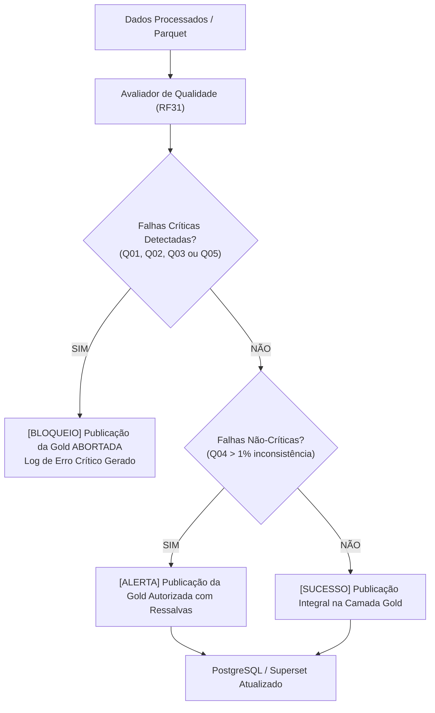

# Especificação e Política de Qualidade de Dados (RF31)

Este documento estabelece o catálogo de regras, métricas, fórmulas matemáticas, severidades e ações em caso de falha para a garantia da qualidade de dados no **Desafio Prático 2 (FIC_DEV)**, atendendo rigorosamente ao requisito **RF31**.

---

## 1. Princípios e Governança de Qualidade

A camada analítica **Gold** é a base para relatórios gerenciais, auditorias e tomada de decisão estratégica via Apache Superset. Consequentemente, **nenhum dado comprometido pode ser publicado na camada Gold**.

O framework opera sob o conceito de **Barreira de Qualidade (Quality Gate)**:
- **Falha Crítica (`CRITICA`):** Bloqueia imediatamente a publicação ou atualização das tabelas da camada Gold, registrando alerta nos logs e isolando a execução.
- **Falha de Aviso (`AVISO`):** Permite a publicação com ressalvas e registra alerta de auditoria para monitoramento contínuo.

---

## 2. Catálogo Oficial dos 5 Testes de Qualidade

| Identificador | Dimensão | Conjunto / Campos Avaliados | Fórmula de Cálculo | Limite Aceitável | Severidade | Ação em Falha |
| :--- | :--- | :--- | :--- | :---: | :---: | :--- |
| **Q01_COMPLETUDE** | **Completude** | `interacoes` (`interacao_id`, `usuario_id`, `conteudo_id`, `tipo_interacao`, `data_hora`) e `catalogo` (`conteudo_id`, `titulo`, `categoria`) | $$\text{Completude (\%)} = \left( 1 - \frac{\sum \text{Campos Nulos}}{\text{Total de Campos}} \right) \times 100$$ | $\ge 100.0\%$ ($0$ nulos) | **CRÍTICA** | **Bloquear publicação da Gold** |
| **Q02_VALIDADE** | **Validade** | `interacoes` (`avaliacao`, `percentual_conclusao`, `tempo_consumido_min`, `tipo_interacao`) | $$\text{Validade (\%)} = \left( 1 - \frac{\sum \text{Registros Inválidos}}{\text{Total de Registros}} \right) \times 100$$ <br> Regras: $\text{avaliacao} \in [1, 5] \cup \{\text{null}\}$; $\text{conclusao} \in [0, 100]$; $\text{tempo} \ge 0$; $\text{tipo} \in \text{Domínio}$. | $\ge 100.0\%$ | **CRÍTICA** | **Bloquear publicação da Gold** |
| **Q03_UNICIDADE** | **Unicidade** | `interacoes` (`interacao_id`) e `catalogo` (`conteudo_id`) | $$\text{Unicidade (\%)} = \left( 1 - \frac{\sum \text{Chaves Duplicadas}}{\text{Total de Chaves}} \right) \times 100$$ | $\ge 100.0\%$ ($0$ duplicatas) | **CRÍTICA** | **Bloquear publicação da Gold** |
| **Q04_CONSISTENCIA** | **Consistência** | `interacoes` (`tipo_interacao`, `percentual_conclusao`) | $$\text{Consistência (\%)} = \left( 1 - \frac{\sum (\text{tipo} = \text{'conclusão'} \land \text{percentual} < 100)}{\text{Total de Conclusões}} \right) \times 100$$ | $\ge 99.0\%$ (Tolerância $\le 1.0\%$) | **AVISO** | **Registrar alerta e permitir com ressalvas** |
| **Q05_INTEGRIDADE_REFERENCIAL** | **Integridade Referencial** | `interacoes` (`conteudo_id`) $\to$ `catalogo` (`conteudo_id`) | $$\text{Integridade (\%)} = \left( 1 - \frac{\sum \text{Órfãos}}{\text{Total de Interações}} \right) \times 100$$ | $\ge 100.0\%$ ($0$ órfãos) | **CRÍTICA** | **Bloquear publicação da Gold** |

---

## 3. Rastreamento e Evolução das Métricas

Os resultados de cada execução do pipeline são persistidos em:
```text
dados/processados/historico_qualidade.json
```

O sistema acompanha a evolução temporal de três métricas centrais ao longo das safras:
1. **Taxa de Completude Geral (`taxa_completude_pct`):** Garante que novas fontes ou alterações de ingestão não introduzam lacunas cadastrais.
2. **Taxa de Validade Numérica e Categórica (`taxa_validade_pct`):** Protege contra *drift* de valores ou erros de digitação em novos lotes.
3. **Taxa de Integridade Referencial (`taxa_integridade_referencial_pct`):** Assegura que interações só sejam computadas se o conteúdo de destino estiver ativo e catalogado.

---

## 4. Política de Bloqueio da Camada Gold


